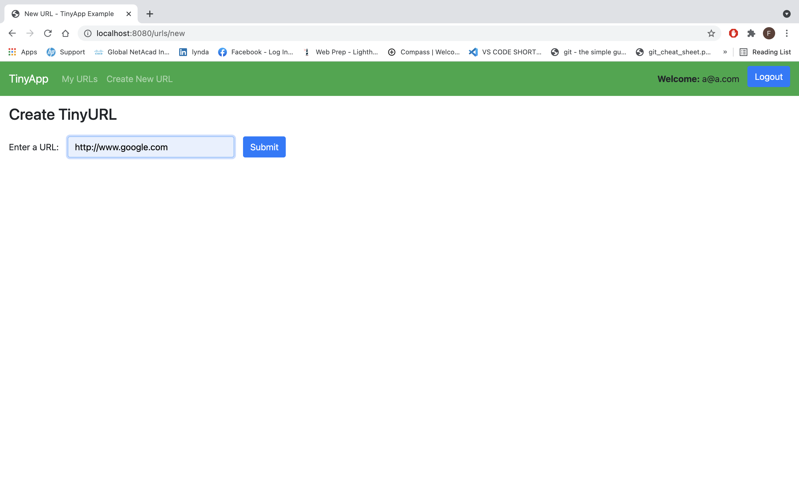
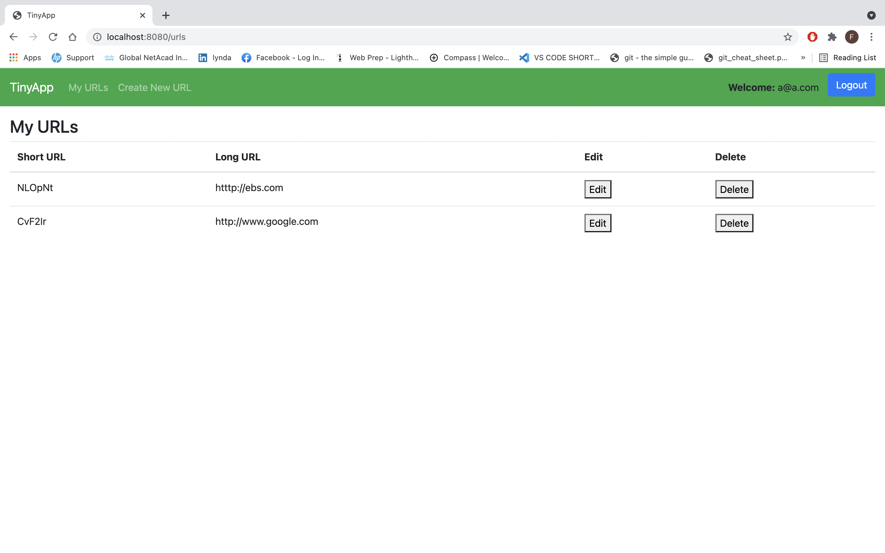

# About TinyApp

TinyApp is a web application that allows users to shorten long URLs, much like TinyURL.com and bit.ly do. The purpose of a URL shortener is to make a URL more manageable. For websites like Twitter, where you are limited by the number of characters, a link such as: https://tiny.app/u/b2xVn2 is a lot better than https://web.compass.lighthouselabs.ca/projects/tiny-app. This also makes a URL more shareable and even customisable.

## Steps on how to use TinyApp

- Run TinyApp from the server side using the `npm start` command.
- Go to your browser and navigate to http://localhost:8080/register to register
- Once you are registered you can create shorturls by providing longurls.
- Users can edit or delete only the urls that they created.

 

